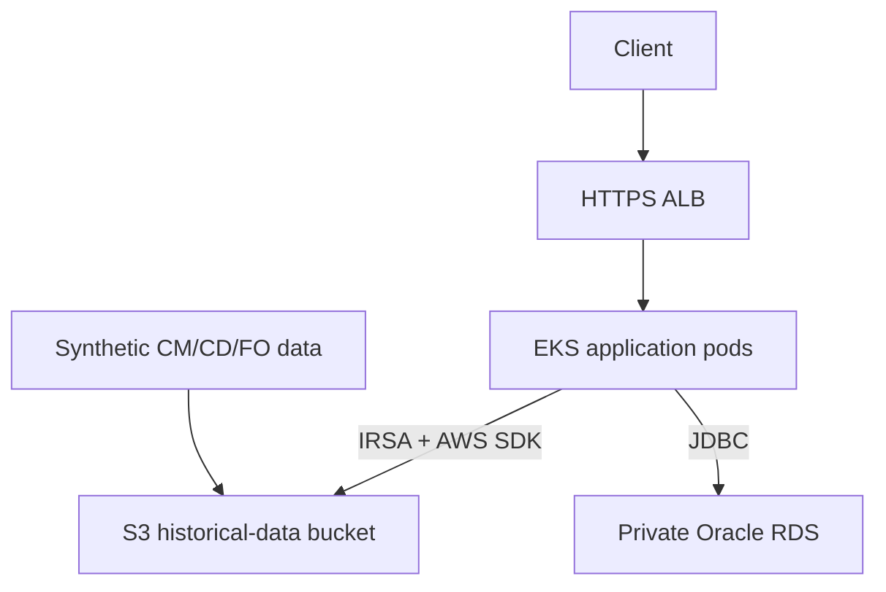

# HistData Dev — Kubernetes Deployment Runbook

**Date:** 17 September 2026  
**Environment:** Dev only  
**Region:** `us-east-1`  
**Purpose:** Record the complete application deployment procedure, today's failures and fixes, the current position, and the safe Dev teardown procedure.

> Production is intentionally out of scope. Dev must work end to end before we design or deploy Production.

---

## 1. What we deployed



The Java 17 Spring Boot application is deployed to EKS using Helm. It reads `.dat` files from S3 through an IAM role associated with its Kubernetes ServiceAccount, connects to private Oracle RDS, records download audits in Oracle, obtains database credentials through External Secrets Operator, and is exposed through an HTTPS AWS ALB.

AWS DataSync remains disabled. Synthetic test files are currently uploaded with AWS CLI.

---

## 2. Repository separation

| Repository | Responsibility |
|---|---|
| `histdata-app` | Java source, Maven tests, Dockerfile and application CI |
| `histdata-infra-terraform` | AWS infrastructure, IAM, EKS, RDS, ECR, S3, ACM and bootstrap stacks |
| `histdata-k8s-deployments` | Helm chart, Dev values, platform add-ons and Kubernetes deployment workflow |

This follows a common company model: application code builds an immutable artifact, Terraform provisions infrastructure, and the deployment repository promotes the approved artifact to Kubernetes.

---

## 3. Current Dev resource inventory

| Resource | Current value |
|---|---|
| AWS account | `935776475838` |
| AWS CLI profile | `histdata-dev` |
| Region | `us-east-1` |
| EKS cluster | `histdata-dev-eks` |
| Current VPC | `vpc-089f72e08daba62d4` |
| ECR repository | `935776475838.dkr.ecr.us-east-1.amazonaws.com/histdata-app` |
| Application image tag | `9a6dbd22f11ad1e38a51da984061f40f5687ce3a` |
| S3 data bucket | `histdata-dev-935776475838-us-east-1` |
| Oracle endpoint | `histdata-dev-oracle.c6z8ka82gj45.us-east-1.rds.amazonaws.com:1521/HISTDB` |
| Application secret | `histdata-dev/oracle/application` |
| Application IRSA role | `histdata-dev-histdata-app` |
| External Secrets IRSA role | `histdata-dev-external-secrets` |
| ALB Controller IRSA role | `histdata-dev-alb-controller` |
| Domain | `dev.histdata.sagarshetty.online` |
| Current ACM certificate | `arn:aws:acm:us-east-1:935776475838:certificate/66047dfe-7083-4479-b30a-c3e35d1794ce` |

Do not store database passwords, AWS temporary credentials or secret values in this document or Git.

---

## 4. Deployment components and ownership

### Terraform-created AWS resources

- VPC and subnets
- internet and NAT routing
- EKS cluster and managed node group
- ECR repository
- S3 historical data bucket
- private Oracle RDS instance
- IAM roles and IRSA trust policies
- AWS Secrets Manager secret containers
- ACM certificate
- security groups

### One-time Kubernetes platform add-ons

- AWS Load Balancer Controller
- External Secrets Operator

### Application Helm release

- namespace `histdata`
- ServiceAccount `histdata-app`
- ConfigMap
- ClusterSecretStore
- ExternalSecret
- generated Kubernetes Secret `histdata-db`
- Deployment with two replicas
- ClusterIP Service
- internet-facing ALB Ingress
- PodDisruptionBudget

HPA is currently disabled. Metrics Server has not been added yet.

---

## 5. Step-by-step Dev deployment

### Step 1 — Authenticate and configure kubectl

```bash
export AWS_PROFILE=histdata-dev
export AWS_REGION=us-east-1
export AWS_DEFAULT_REGION=us-east-1

aws sso login --profile histdata-dev
aws sts get-caller-identity --profile histdata-dev

aws eks update-kubeconfig \
  --name histdata-dev-eks \
  --region us-east-1 \
  --profile histdata-dev
```

```bash
kubectl get nodes -o wide
kubectl get pods -A
```

Expected: two managed nodes are `Ready`; CoreDNS, VPC CNI and kube-proxy are running.

### Step 2 — Build and push the application image

The application GitHub Actions workflow:

1. checks out source;
2. configures Java 17;
3. runs Maven tests;
4. obtains temporary AWS credentials through GitHub OIDC;
5. logs in to ECR;
6. builds the Docker image;
7. pushes it with the Git commit SHA as an immutable tag.

Successful image:

```text
935776475838.dkr.ecr.us-east-1.amazonaws.com/histdata-app:9a6dbd22f11ad1e38a51da984061f40f5687ce3a
```

```bash
aws ecr describe-images \
  --repository-name histdata-app \
  --image-ids imageTag=9a6dbd22f11ad1e38a51da984061f40f5687ce3a \
  --region us-east-1 \
  --profile histdata-dev
```

### Step 3 — Install platform add-ons

```bash
cd ~/appln/histdata-modernization-lab/histdata-k8s-deployments
./platform-addons/install.sh
```

| Release | Namespace | Chart version |
|---|---|---:|
| `aws-load-balancer-controller` | `kube-system` | `3.5.0` |
| `external-secrets` | `external-secrets` | `2.10.0` |

```bash
helm list -A
kubectl get pods -n kube-system
kubectl get pods -n external-secrets

kubectl get serviceaccount aws-load-balancer-controller \
  -n kube-system -o yaml

kubectl get serviceaccount external-secrets \
  -n external-secrets -o yaml
```

Both ServiceAccounts must contain the appropriate `eks.amazonaws.com/role-arn` annotation.

### Step 4 — Prepare Oracle application credentials

| Secret | Purpose | Lifecycle |
|---|---|---|
| RDS master secret | Administrative RDS credential generated and managed by RDS | Tied to the RDS instance |
| HistData application secret | Least-privilege `HISTDATA` schema credential used by the application | Intentionally retained for reuse |

Terraform created the application secret container without placing its password in Terraform state.

Using a temporary Oracle client pod inside EKS, we:

1. loaded the RDS master credential and generated application credential into a temporary Kubernetes Secret;
2. verified private connectivity to Oracle port `1521`;
3. connected as the RDS master user;
4. created Oracle user `HISTDATA`;
5. assigned `USERS` as the default tablespace and `TEMP` as the temporary tablespace;
6. assigned a `200M` quota on `USERS`;
7. granted `CREATE SESSION`, `CREATE TABLE` and `CREATE SEQUENCE`;
8. tested login as `HISTDATA`;
9. stored JSON properties `username` and `password` in `histdata-dev/oracle/application`;
10. deleted the temporary Kubernetes Pod and Secret;
11. unset temporary shell password variables.

Never print or commit credential values.

### Step 5 — Upload synthetic historical files

Expected S3 key layout:

```text
CM/YYYY-MM-DD/file.dat
CD/YYYY-MM-DD/file.dat
FO/YYYY-MM-DD/file.dat
```

Test objects uploaded today:

```text
CM/2026-09-17/cm_trade.dat
CD/2026-09-17/cd_trade.dat
FO/2026-09-17/fo_trade.dat
```

```bash
aws s3 ls s3://histdata-dev-935776475838-us-east-1/ \
  --recursive \
  --region us-east-1 \
  --profile histdata-dev
```

### Step 6 — Prepare and validate Helm values

Important Dev values:

```yaml
replicaCount: 2

image:
  repository: 935776475838.dkr.ecr.us-east-1.amazonaws.com/histdata-app
  tag: 9a6dbd22f11ad1e38a51da984061f40f5687ce3a

serviceAccount:
  roleArn: arn:aws:iam::935776475838:role/histdata-dev-histdata-app

application:
  awsRegion: us-east-1
  s3Bucket: histdata-dev-935776475838-us-east-1
  dbUrl: jdbc:oracle:thin:@//histdata-dev-oracle.c6z8ka82gj45.us-east-1.rds.amazonaws.com:1521/HISTDB

externalSecret:
  remoteSecretArn: arn:aws:secretsmanager:us-east-1:935776475838:secret:histdata-dev/oracle/application-AFRfIt

ingress:
  host: dev.histdata.sagarshetty.online
  certificateArn: arn:aws:acm:us-east-1:935776475838:certificate/66047dfe-7083-4479-b30a-c3e35d1794ce

autoscaling:
  enabled: false
```

```bash
helm lint charts/histdata -f environments/dev/values.yaml

helm template histdata charts/histdata \
  --namespace histdata \
  -f environments/dev/values.yaml \
  > /tmp/histdata-dev-rendered.yaml

rg -n 'ap-south-1|000000000000|replace-me|example.com' \
  environments/dev/values.yaml \
  /tmp/histdata-dev-rendered.yaml
```

Expected: Helm lint passes and the placeholder search returns no matches.

### Step 7 — Install the application release

For the first deployment, do not use `--atomic`; preserving failed resources helps troubleshooting.

```bash
helm upgrade --install histdata charts/histdata \
  --namespace histdata \
  --create-namespace \
  -f environments/dev/values.yaml \
  --wait \
  --timeout 10m
```

Once stable, CI/CD deployments can use `--atomic` for automatic rollback.

### Step 8 — Verify secret synchronization

```bash
kubectl get clustersecretstore
kubectl get externalsecret -n histdata
kubectl get secret histdata-db -n histdata
```

Expected:

```text
ClusterSecretStore: Valid / Ready=True
ExternalSecret:     SecretSynced / Ready=True
histdata-db:        Opaque secret with two keys
```

Do not display `histdata-db` with `-o yaml`; it contains encoded database credentials.

### Step 9 — Verify the workload

```bash
helm status histdata -n histdata

kubectl rollout status deployment/histdata-histdata \
  -n histdata \
  --timeout=10m

kubectl get pods -n histdata -o wide
kubectl get service -n histdata
kubectl get ingress -n histdata
```

Successful state achieved today:

```text
Two application pods: Running and Ready 1/1
ExternalSecret:       SecretSynced=True
Kubernetes DB Secret: Created
ALB Ingress:          SuccessfullyReconciled
```

### Step 10 — Verify ALB and application health

```bash
ALB_DNS=$(kubectl get ingress histdata-histdata \
  -n histdata \
  -o jsonpath='{.status.loadBalancer.ingress[0].hostname}')

printf '%s\n' "$ALB_DNS"

curl -k \
  --max-time 20 \
  -H 'Host: dev.histdata.sagarshetty.online' \
  "https://${ALB_DNS}/actuator/health/readiness"
```

Expected response:

```json
{"status":"UP"}
```

### Step 11 — Configure DNS

The Route 53 hosted zone exists, but the final application record still needs verification/configuration:

```text
dev.histdata.sagarshetty.online -> current ALB hostname
```

```bash
dig dev.histdata.sagarshetty.online +short
curl -I https://dev.histdata.sagarshetty.online
```

---

## 6. Problems encountered and fixes

### 6.1 ALB Controller Helm annotation parsing failed

**Error:** `metadata.annotations` was rendered as an object instead of a string.

**Cause:** Incorrect shell escaping around the ServiceAccount annotation key.

**Fix:** Quote the complete `--set-string` expression:

```bash
--set-string "serviceAccount.annotations.eks\\.amazonaws\\.com/role-arn=${ROLE_ARN}"
```

### 6.2 External Secrets API version mismatch

**Error:** The chart used `external-secrets.io/v1beta1`, but External Secrets Operator `2.10.0` serves `external-secrets.io/v1`.

**Fix:** Change both `secretstore.yaml` and `externalsecret.yaml` to:

```yaml
apiVersion: external-secrets.io/v1
```

### 6.3 Application secret had no usable version

**Cause:** Terraform intentionally created only the secret container.

**Fix:** Create and test the Oracle `HISTDATA` user, then store `username` and `password` as an `AWSCURRENT` secret version.

### 6.4 Application secret was marked for deletion

**Error:** `PutSecretValue` could not run while the secret was scheduled for deletion.

**Fix:** Restore the secret, then write its new version.

### 6.5 Oracle login and username creation errors

**Errors:** `ORA-01017` and `ORA-00972`.

**Fixes:** Correct SQL*Plus quoting for the lowercase master username, use `SET DEFINE OFF`, reduce the generated Oracle application password to a supported length, and verify both master and application logins.

### 6.6 First Helm deployment timed out

**Symptoms:** `ImagePullBackOff` and ExternalSecret `AccessDeniedException`.

**Image fix:** Verify the immutable tag in ECR and allow Kubernetes to retry/pull during the new rollout.

**Secret cause:** The External Secrets role existed without its permissions policy.

**Secret fix:** Terraform created `read-histdata-secrets` with:

```text
secretsmanager:GetSecretValue
secretsmanager:DescribeSecret
```

### 6.7 Terraform state missed the existing application secret

**Symptom:** Terraform planned to create a secret that already existed.

**Cause:** The secret had been restored outside Terraform and was absent from state.

**Fix:** Import it before applying:

```bash
terraform import \
  -var-file=dev.tfvars \
  'module.rds.aws_secretsmanager_secret.application' \
  '<existing-application-secret-arn>'
```

### 6.8 ALB Controller lacked AWS permissions

**Error:** `UnauthorizedOperation: ec2:DescribeRouteTables`.

**Cause:** The custom controller policy was incomplete.

**Fix:** Vendor the official controller `v3.5.0` policy and load it with Terraform:

```hcl
resource "aws_iam_role_policy" "alb_controller" {
  name   = "aws-load-balancer-controller"
  role   = aws_iam_role.alb_controller.id
  policy = file("${path.module}/policies/aws-load-balancer-controller-v3.5.0.json")
}
```

### 6.9 ALB Controller referenced an obsolete VPC

**Error:** `Evaluated 0 subnets`.

Subnet tags were correct. The real cause was configuration drift:

```text
Controller VPC: vpc-0a9306a710ae149e9
Current VPC:    vpc-089f72e08daba62d4
```

**Fix:** Upgrade the controller using the current Terraform output:

```bash
CURRENT_VPC_ID=$(terraform -chdir=environments/dev output -raw vpc_id)

helm upgrade aws-load-balancer-controller \
  eks/aws-load-balancer-controller \
  --namespace kube-system \
  --version 3.5.0 \
  --reuse-values \
  --set-string vpcId="$CURRENT_VPC_ID" \
  --wait \
  --timeout 5m
```

Result: `SuccessfullyReconciled`.

### 6.10 ACM certificate ARN changed

**Cause:** Recreating Dev produced a new ACM certificate ARN.

**Fix:** Update `environments/dev/values.yaml` from the current Terraform output before upgrading Helm.

---

## 7. Current position at the end of today

### Completed

- [x] Dev AWS infrastructure created.
- [x] Application GitHub OIDC build role working.
- [x] Java image built and pushed to ECR.
- [x] EKS nodes healthy.
- [x] ALB Controller and External Secrets installed with IRSA.
- [x] Oracle connectivity verified from EKS.
- [x] Oracle `HISTDATA` user created and tested.
- [x] Application credential stored in Secrets Manager.
- [x] Synthetic CM/CD/FO files uploaded to S3.
- [x] External Secrets templates corrected to `v1`.
- [x] ExternalSecret synchronized successfully.
- [x] Two application pods became Ready.
- [x] ALB Controller IAM policy corrected.
- [x] Controller VPC drift corrected.
- [x] Ingress successfully reconciled.

### Pending

- [ ] Verify the ALB address and readiness endpoint.
- [ ] Configure/verify the Route 53 application record.
- [ ] Verify HTTPS using the domain.
- [ ] Persist current VPC lookup in `platform-addons/install.sh`.
- [ ] Commit and raise PRs for Terraform and Kubernetes changes.
- [ ] Add controlled AWS-profile user/subscription seed data.
- [ ] Test S3 listing/download from the application.
- [ ] Verify Oracle download-audit records.
- [ ] Test Helm rollback.
- [ ] Complete Kubernetes deployment pipeline OIDC/network access.
- [ ] Add Metrics Server before enabling HPA.
- [ ] Implement DataSync later.

---

## 8. Recommended Git commits

### Terraform repository

```text
Files:
modules/iam/main.tf
modules/iam/policies/aws-load-balancer-controller-v3.5.0.json

Commit:
fix(iam): align platform roles with controller requirements
```

### Kubernetes repository

```text
Files:
charts/histdata/templates/externalsecret.yaml
charts/histdata/templates/secretstore.yaml
environments/dev/values.yaml
platform-addons/install.sh  # after persisting the VPC fix

Commit:
fix(dev): align Helm deployment with AWS infrastructure
```

Never commit `.terraform/`, `*.tfplan`, `destroy.tfplan`, passwords, AWS credentials or Kubernetes Secret values.

---

## 9. Safe Dev teardown while retaining the application secret

Retain `histdata-dev/oracle/application`. Do not retain the RDS master secret because it belongs to the RDS instance.

### Step 1 — Verify the application secret

```bash
cd ~/appln/histdata-modernization-lab/histdata-infra-terraform/environments/dev

APP_SECRET_ARN=$(terraform output -raw oracle_application_secret_arn)

aws secretsmanager describe-secret \
  --secret-id "$APP_SECRET_ARN" \
  --region us-east-1 \
  --profile histdata-dev \
  --query '{Name:Name,ARN:ARN,DeletedDate:DeletedDate}' \
  --output table
```

### Step 2 — Detach the secret from Dev state

`prevent_destroy` alone would block the complete environment destroy. Removing this resource from state does not delete it from AWS.

```bash
terraform state rm \
  'module.rds.aws_secretsmanager_secret.application'
```

```bash
aws secretsmanager describe-secret \
  --secret-id histdata-dev/oracle/application \
  --region us-east-1 \
  --profile histdata-dev \
  --query '{Name:Name,ARN:ARN,DeletedDate:DeletedDate}' \
  --output table
```

Import this secret before applying a recreated Dev environment.

### Step 3 — Delete the application while the controller still runs

```bash
ALB_DNS=$(kubectl get ingress histdata-histdata \
  -n histdata \
  -o jsonpath='{.status.loadBalancer.ingress[0].hostname}')

helm uninstall histdata -n histdata
kubectl delete namespace histdata --wait
```

Wait until the controller deletes the ALB:

```bash
aws elbv2 describe-load-balancers \
  --region us-east-1 \
  --profile histdata-dev \
  --query "LoadBalancers[?DNSName=='${ALB_DNS}'].DNSName" \
  --output text
```

Expected: no output.

### Step 4 — Uninstall platform add-ons

Remove the ALB Controller last:

```bash
helm uninstall external-secrets -n external-secrets
kubectl delete namespace external-secrets --wait

helm uninstall aws-load-balancer-controller -n kube-system
```

### Step 5 — Generate and review the destroy plan

```bash
CURRENT_EKS_CIDR=$(aws eks describe-cluster \
  --name histdata-dev-eks \
  --region us-east-1 \
  --profile histdata-dev \
  --query 'cluster.resourcesVpcConfig.publicAccessCidrs[0]' \
  --output text)

export TF_VAR_cluster_public_access_cidrs="[\"$CURRENT_EKS_CIDR\"]"

terraform plan \
  -destroy \
  -var-file=dev.tfvars \
  -out=destroy.tfplan
```

Confirm the application secret is absent:

```bash
terraform show -no-color destroy.tfplan |
rg 'aws_secretsmanager_secret.application|histdata-dev/oracle/application'
```

Expected: no output. After reviewing the complete plan:

```bash
terraform apply destroy.tfplan
```

### Step 6 — Verify preservation

```bash
aws secretsmanager describe-secret \
  --secret-id histdata-dev/oracle/application \
  --region us-east-1 \
  --profile histdata-dev \
  --query '{Name:Name,ARN:ARN,DeletedDate:DeletedDate}' \
  --output table
```

The bootstrap state bucket, GitHub OIDC bootstrap state and Route 53 hosted zone have separate Terraform states and are not destroyed by the Dev environment destroy.

Long-term improvement: move the reusable application secret into a separate bootstrap/security Terraform state.

---

## 10. Tomorrow's review order

1. Review the three repository responsibilities.
2. Review IRSA for the application, External Secrets and ALB Controller.
3. Review the RDS master secret versus the application secret.
4. Review the Helm chart and Dev values.
5. Explain each failure from Section 6 using the evidence that identified it.
6. Confirm both Git commits and PRs.
7. Confirm the application secret remains after teardown.
8. Decide whether to recreate Dev immediately or first improve the add-on/deployment automation.

---

## 11. Interview-ready summary

> We separated application, infrastructure and Kubernetes deployment code into three repositories. Terraform provisioned the Dev VPC, EKS, ECR, S3, private Oracle RDS, IAM/IRSA roles, Secrets Manager and ACM. GitHub Actions tested the Java application and used GitHub OIDC to push an immutable Git-SHA image to ECR. We installed the AWS Load Balancer Controller and External Secrets Operator with IRSA, created a least-privilege Oracle application schema, synchronized its credential from Secrets Manager, and deployed two application replicas using Helm. The application accessed S3 through its ServiceAccount role and was exposed through an HTTPS ALB. During deployment we diagnosed missing IAM permissions, Terraform state drift and an obsolete VPC ID in the controller Helm release. We corrected each issue through code and verified that the Ingress reconciled successfully.

Key troubleshooting lesson:

> Follow the path one layer at a time: Helm release, Kubernetes resources, Secret synchronization, Pod status, application logs, Service endpoints, Ingress events, controller logs and AWS resources. Do not change multiple layers without identifying which boundary failed.


----------------------------------------


Steps for Oracle user creation

Retrieve the master credential into memory
MASTER_SECRET_JSON="$(
  aws secretsmanager get-secret-value \
    --secret-id 'arn:aws:secretsmanager:us-east-1:935776475838:secret:rds!db-2d52ae3f-79af-4c93-9dea-86d5bd84254a-ixeuzN' \
    --profile histdata-dev \
    --region us-east-1 \
    --query SecretString \
    --output text
)"

Extract the username and password:

export MASTER_USERNAME="$(
  jq -r '.username' <<< "$MASTER_SECRET_JSON"
)"

export MASTER_PASSWORD="$(
  jq -r '.password' <<< "$MASTER_SECRET_JSON"
)"

unset MASTER_SECRET_JSON

Verify without printing the password:

printf 'Master username: %s\n' "$MASTER_USERNAME"
printf 'Master password length: %s characters\n' "${#MASTER_PASSWORD}"

Generate the application credential

export APP_USERNAME="HISTDATA"

export APP_PASSWORD="$(
  openssl rand -base64 18 |
  tr '+/' '-_' |
  tr -d '=\n'
)"


Create a temporary Kubernetes bootstrap Secret

kubectl delete secret oracle-bootstrap \
  --ignore-not-found
  
  kubectl create secret generic oracle-bootstrap \
  --from-literal=MASTER_USERNAME="$MASTER_USERNAME" \
  --from-literal=MASTER_PASSWORD="$MASTER_PASSWORD" \
  --from-literal=APP_USERNAME="$APP_USERNAME" \
  --from-literal=APP_PASSWORD="$APP_PASSWORD"


kubectl get secret oracle-bootstrap \
  -o json |
jq -r '.data | keys[]'


APP_PASSWORD
APP_USERNAME
MASTER_PASSWORD
MASTER_USERNAME


unset MASTER_PASSWORD
unset APP_PASSWORD


Step 7B — Start a temporary Oracle SQL client

kubectl delete pod oracle-bootstrap-client \
  --ignore-not-found \
  --wait=true
  
  kubectl apply -f - <<'YAML'
apiVersion: v1
kind: Pod
metadata:
  name: oracle-bootstrap-client
  labels:
    purpose: oracle-bootstrap
spec:
  restartPolicy: Never
  containers:
    - name: oracle-client
      image: gvenzl/oracle-free:23-slim-faststart
      command:
        - /bin/bash
        - -c
        - sleep 3600
      env:
        - name: MASTER_USERNAME
          valueFrom:
            secretKeyRef:
              name: oracle-bootstrap
              key: MASTER_USERNAME
        - name: MASTER_PASSWORD
          valueFrom:
            secretKeyRef:
              name: oracle-bootstrap
              key: MASTER_PASSWORD
        - name: APP_USERNAME
          valueFrom:
            secretKeyRef:
              name: oracle-bootstrap
              key: APP_USERNAME
        - name: APP_PASSWORD
          valueFrom:
            secretKeyRef:
              name: oracle-bootstrap
              key: APP_PASSWORD
YAML


kubectl wait \
  --for=condition=Ready \
  pod/oracle-bootstrap-client \
  --timeout=180s
  
  kubectl get pod oracle-bootstrap-client -o wide
  
  kubectl exec oracle-bootstrap-client -- \
  bash -lc 'command -v sqlplus || find /opt/oracle -type f -name sqlplus 2>/dev/null | head -1'
  
  /opt/oracle/product/23ai/dbhomeFree/bin/sqlplus
  
  kubectl exec oracle-bootstrap-client -- bash -lc '
for name in MASTER_USERNAME MASTER_PASSWORD APP_USERNAME APP_PASSWORD; do
  if [ -n "$(printenv "$name")" ]; then
    echo "$name loaded"
  else
    echo "$name MISSING"
  fi
done
'

MASTER_USERNAME loaded
MASTER_PASSWORD loaded
APP_USERNAME loaded
APP_PASSWORD loaded


Step 7C — Test the Oracle master login

kubectl exec oracle-bootstrap-client -- bash -lc '
sqlplus -s /nolog <<SQL
WHENEVER OSERROR EXIT FAILURE
WHENEVER SQLERROR EXIT SQL.SQLCODE

SET DEFINE OFF

CONNECT ${MASTER_USERNAME}/"${MASTER_PASSWORD}"@//histdata-dev-oracle.c6z8ka82gj45.us-east-1.rds.amazonaws.com:1521/HISTDB

SET HEADING OFF
SET FEEDBACK OFF
SET PAGESIZE 0

SELECT
  SYS_CONTEXT('\''USERENV'\'','\''SESSION_USER'\'')
  || '\'' connected to '\''
  || SYS_CONTEXT('\''USERENV'\'','\''SERVICE_NAME'\'')
FROM dual;

EXIT SUCCESS
SQL
'

Step 7D — Create the HISTDATA application user

kubectl exec oracle-bootstrap-client -- bash -lc "
sqlplus -s /nolog <<SQL
WHENEVER OSERROR EXIT FAILURE
WHENEVER SQLERROR EXIT SQL.SQLCODE

SET DEFINE OFF
SET SERVEROUTPUT ON

CONNECT \${MASTER_USERNAME}/\"\${MASTER_PASSWORD}\"@//histdata-dev-oracle.c6z8ka82gj45.us-east-1.rds.amazonaws.com:1521/HISTDB

DECLARE
  user_count NUMBER;
BEGIN
  SELECT COUNT(*)
  INTO user_count
  FROM dba_users
  WHERE username = UPPER('\${APP_USERNAME}');

  IF user_count = 0 THEN
    EXECUTE IMMEDIATE
      'CREATE USER \${APP_USERNAME} IDENTIFIED BY \"\${APP_PASSWORD}\"
       DEFAULT TABLESPACE USERS
       TEMPORARY TABLESPACE TEMP
       QUOTA 200M ON USERS';

    DBMS_OUTPUT.PUT_LINE('Created user \${APP_USERNAME}');
  ELSE
    EXECUTE IMMEDIATE
      'ALTER USER \${APP_USERNAME}
       IDENTIFIED BY \"\${APP_PASSWORD}\"
       ACCOUNT UNLOCK';

    EXECUTE IMMEDIATE
      'ALTER USER \${APP_USERNAME}
       QUOTA 200M ON USERS';

    DBMS_OUTPUT.PUT_LINE('Updated existing user \${APP_USERNAME}');
  END IF;
END;
/

GRANT CREATE SESSION, CREATE TABLE, CREATE SEQUENCE
TO \${APP_USERNAME};

SET HEADING ON
SET FEEDBACK ON
SET PAGESIZE 50

SELECT
  username,
  account_status,
  default_tablespace,
  temporary_tablespace
FROM dba_users
WHERE username = UPPER('\${APP_USERNAME}');

EXIT SUCCESS
SQL
"

kubectl exec oracle-bootstrap-client -- bash -lc "
sqlplus -s /nolog <<SQL
WHENEVER OSERROR EXIT FAILURE
WHENEVER SQLERROR EXIT SQL.SQLCODE

SET DEFINE OFF

CONNECT \${APP_USERNAME}/\"\${APP_PASSWORD}\"@//histdata-dev-oracle.c6z8ka82gj45.us-east-1.rds.amazonaws.com:1521/HISTDB

SET HEADING OFF
SET FEEDBACK OFF
SET PAGESIZE 0

SELECT
  SYS_CONTEXT('USERENV','SESSION_USER')
  || ' connected successfully'
FROM dual;

EXIT SUCCESS
SQL
"

Step 7F — Populate the application secret

export APP_SECRET_ARN='arn:aws:secretsmanager:us-east-1:935776475838:secret:histdata-dev/oracle/application-AFRfIt'

APP_USERNAME="$(
  kubectl get secret oracle-bootstrap \
    -o jsonpath='{.data.APP_USERNAME}' |
  base64 --decode
)"

APP_PASSWORD="$(
  kubectl get secret oracle-bootstrap \
    -o jsonpath='{.data.APP_PASSWORD}' |
  base64 --decode
)"

printf 'Application username: %s\n' "$APP_USERNAME"
printf 'Application password length: %s\n' "${#APP_PASSWORD}"

APP_SECRET_JSON="$(
  jq -nc \
    --arg username "$APP_USERNAME" \
    --arg password "$APP_PASSWORD" \
    '{username:$username,password:$password}'
)"


aws secretsmanager put-secret-value \
  --secret-id "$APP_SECRET_ARN" \
  --secret-string "$APP_SECRET_JSON" \
  --profile histdata-dev \
  --region us-east-1 \
  --query '{
    ARN:ARN,
    VersionId:VersionId,
    VersionStages:VersionStages
  }' \
  --output table
  
  aws secretsmanager get-secret-value \
  --secret-id "$APP_SECRET_ARN" \
  --profile histdata-dev \
  --region us-east-1 \
  --query SecretString \
  --output text |
jq -r 'keys[]'

unset APP_USERNAME
unset APP_PASSWORD
unset APP_SECRET_JSON

Delete the temporary bootstrap resources

kubectl delete pod oracle-bootstrap-client
kubectl delete secret oracle-bootstrap

Verify cleanup:

kubectl get pod oracle-bootstrap-client \
  --ignore-not-found

kubectl get secret oracle-bootstrap \
  --ignore-not-found

------------------------------------------------------------------------

Step 8 — Upload synthetic historical data

export HISTDATA_BUCKET="histdata-dev-935776475838-us-east-1"
export TEST_DATE="2026-09-17"
export TEST_DATA_DIR="$(mktemp -d)"

mkdir -p \
  "$TEST_DATA_DIR/CM/$TEST_DATE" \
  "$TEST_DATA_DIR/CD/$TEST_DATE" \
  "$TEST_DATA_DIR/FO/$TEST_DATE"
  
  printf '%s\n' \
  'TRADE_ID|SYMBOL|PRICE|QUANTITY|TRADE_TIME' \
  'CM10001|RELIANCE|2950.50|100|09:15:01' \
  'CM10002|TCS|4125.75|50|09:15:02' \
  > "$TEST_DATA_DIR/CM/$TEST_DATE/cm_trade.dat"
  
  printf '%s\n' \
  'TRADE_ID|CONTRACT|PRICE|QUANTITY|TRADE_TIME' \
  'CD10001|USDINR|83.1250|1000|09:15:01' \
  'CD10002|EURINR|90.4500|500|09:15:02' \
  > "$TEST_DATA_DIR/CD/$TEST_DATE/cd_trade.dat"
  
  printf '%s\n' \
  'TRADE_ID|CONTRACT|PRICE|QUANTITY|TRADE_TIME' \
  'FO10001|NIFTY-FUT|24550.25|50|09:15:01' \
  'FO10002|BANKNIFTY-FUT|52800.75|30|09:15:02' \
  > "$TEST_DATA_DIR/FO/$TEST_DATE/fo_trade.dat"
  
  find "$TEST_DATA_DIR" -type f -print
  
  aws s3 sync \
  "$TEST_DATA_DIR/" \
  "s3://$HISTDATA_BUCKET/" \
  --profile histdata-dev \
  --region us-east-1
  
  aws s3 ls \
  "s3://$HISTDATA_BUCKET/" \
  --recursive \
  --profile histdata-dev \
  --region us-east-1
  
  aws s3 cp \
  "s3://$HISTDATA_BUCKET/CM/$TEST_DATE/cm_trade.dat" \
  - \
  --profile histdata-dev \
  --region us-east-1
  
  -------------------------------------------------
  
  Step 9A — Final client-side dry run
  
  helm upgrade --install histdata charts/histdata \
  --namespace histdata \
  --create-namespace \
  -f environments/dev/values.yaml \
  --dry-run
    
  helm upgrade --install histdata charts/histdata \
  --namespace histdata \
  --create-namespace \
  -f environments/dev/values.yaml \
  --wait \
  --timeout 10m


